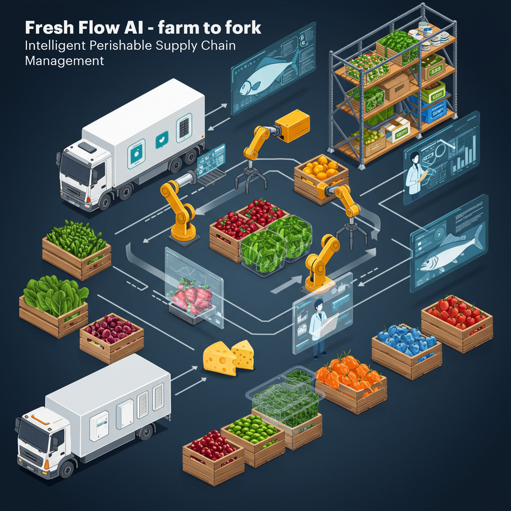
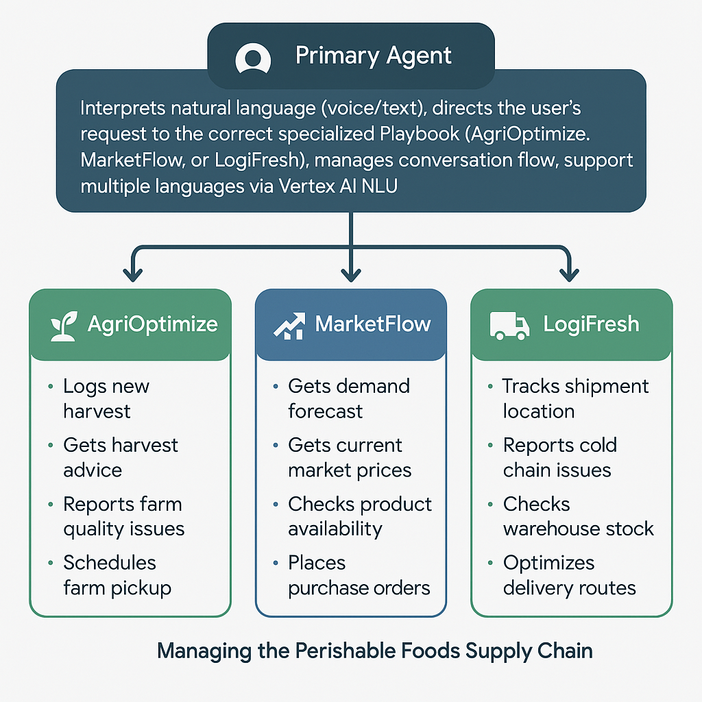
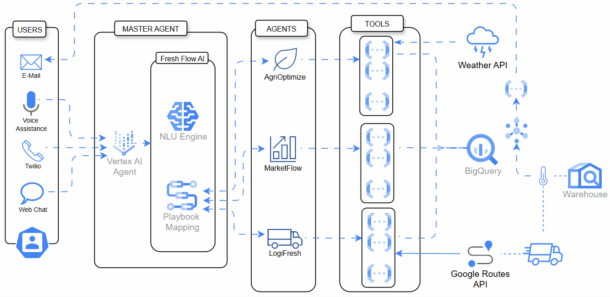

# FreshFlow AI: Intelligent Perishable Supply Chain Assistant

Welcome to the FreshFlow AI GitHub repository! This project demonstrates an innovative conversational AI solution designed to tackle the unique challenges of managing perishable food supply chains using Google Cloud Platform.



## 📊 Project Overview

FreshFlow AI is a Google Cloud-based multimodal agentic solution that streamlines perishable supply chains. Its multilingual conversational intelligence integrates data, automates workflows across farm, market, and logistics, and delivers predictive insights with real-time alerts – enabling faster, smarter decisions to improve efficiency and reduce waste from farm to fork.

FreshFlow AI aims to reduce waste, improve efficiency, and provide real-time visibility across the perishable food supply chain (from farm to fork). It does this by providing a unified, natural language interface powered by an Agentic AI architecture built on Google Cloud services.

## 💡 The Problem

The supply chain for perishable goods (fruits, vegetables, etc.) is highly inefficient, leading to significant waste (over 13% lost post-harvest, FAO SOFA 2019), primarily due to:
*   Limited shelf life & strict cold chain needs.
*   Volatile supply and demand.
*   Fragmented networks and manual processes.
*   Disconnected data silos preventing real-time visibility.

## ✨ The Solution: FreshFlow AI

FreshFlow AI is a Google Cloud-based multimodal agentic solution that streamlines perishable supply chains. Its multilingual conversational intelligence integrates data, automates workflows across farm, market, and logistics, and delivers predictive insights with real-time alerts – enabling faster, smarter decisions to improve efficiency and reduce waste from farm to fork.

It leverages:
*   **Conversational AI (Vertex AI Conversation):** As the intuitive user interface and workflow orchestrator.
*   **Centralized Data (BigQuery):** A single source of truth for all supply chain data.
*   **Backend Logic (Cloud Functions):** Specialized APIs performing operations against the data.

## 🤖 Agent Interactions & Scopes



*Figure: Illustration of how different AI agents interact within FreshFlow AI, each operating within their defined scopes (e.g., inventory management, logistics, demand forecasting), and collaborating via orchestrated workflows to optimize the perishable supply chain.*

## 🏗️ High-Level Architecture

FreshFlow AI follows an agentic architecture where a central AI agent (Vertex AI Conversation) understands user goals via Playbooks and calls specific backend Cloud Functions ("Tools") to access or update data in BigQuery.



*Figure: High-level architecture of FreshFlow AI, illustrating the integration of Vertex AI Conversation, Cloud Functions, and BigQuery on Google Cloud Platform.*

## 📁 Project Structure

Below is an overview of the key folders included in this repository:

```
freshflowai/
├── functions/                # Cloud Functions source code and APIs
├── bq_tables_schemas/        # BigQuery table schema definitions
├── conversational-agents/    # Additional conversational agent logic and configs
└── ReadMe.md                 # Project documentation (this file)
```

Each folder contains a `README.md` with more details about its contents and usage.

## Contributing

Feel free to open issues or submit pull requests for improvements or bug fixes.
