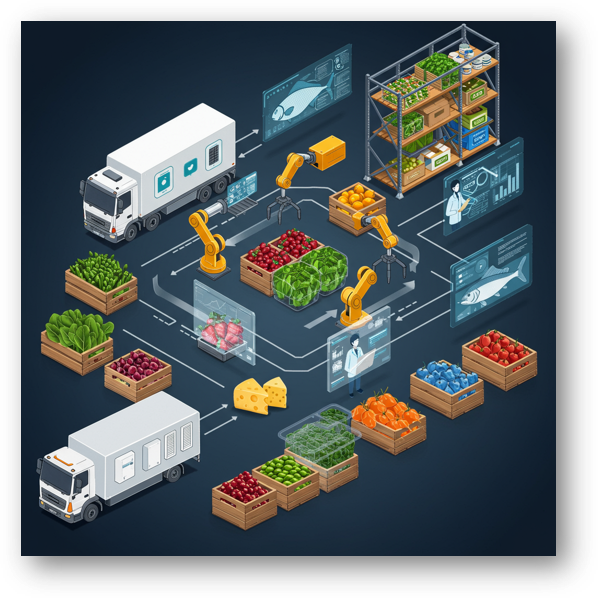
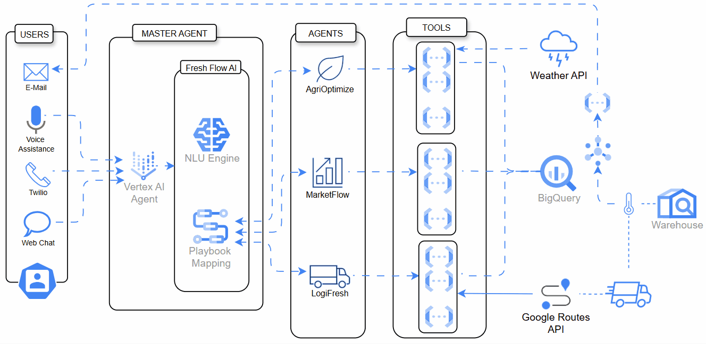

# FreshFlow AI: Intelligent Perishable Supply Chain Assistant

Welcome to the FreshFlow AI GitHub repository! This project demonstrates an innovative conversational AI solution designed to tackle the unique challenges of managing perishable food supply chains using Google Cloud Platform.

## 📊 Project Overview

FreshFlow AI aims to reduce waste, improve efficiency, and provide real-time visibility across the perishable food supply chain (from farm to fork). It does this by providing a unified, natural language interface powered by an Agentic AI architecture built on Google Cloud services.

## 💡 The Problem

The supply chain for perishable goods (fruits, vegetables, etc.) is highly inefficient, leading to significant waste (over 13% lost post-harvest, FAO SOFA 2019), primarily due to:
*   Limited shelf life & strict cold chain needs.
*   Volatile supply and demand.
*   Fragmented networks and manual processes.
*   Disconnected data silos preventing real-time visibility.

## ✨ The Solution: FreshFlow AI

FreshFlow AI acts as an intelligent hub, enabling users across the supply chain to interact with operational data and automate workflows conversationally.

It leverages:
*   **Conversational AI (Vertex AI Conversation):** As the intuitive user interface and workflow orchestrator.
*   **Centralized Data (BigQuery):** A single source of truth for all supply chain data.
*   **Backend Logic (Cloud Functions):** Specialized APIs performing operations against the data.

## 🏗️ High-Level Architecture

FreshFlow AI follows an agentic architecture where a central AI agent (Vertex AI Conversation) understands user goals via Playbooks and calls specific backend Cloud Functions ("Tools") to access or update data in BigQuery.

*Figure: High-level architecture of FreshFlow AI, illustrating the integration of Vertex AI Conversation, Cloud Functions, and BigQuery on Google Cloud Platform.*